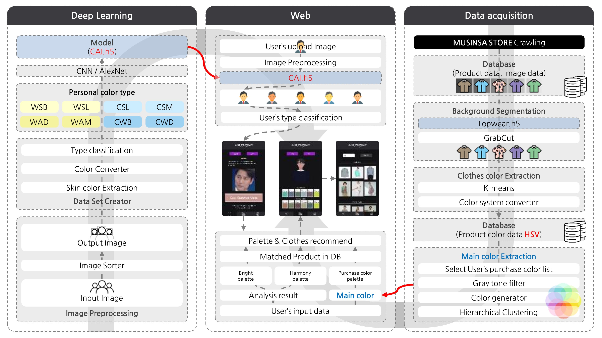
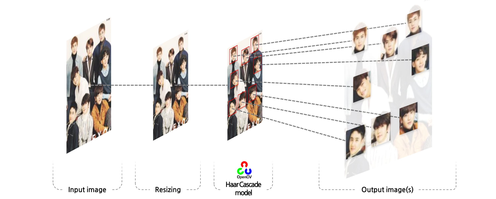
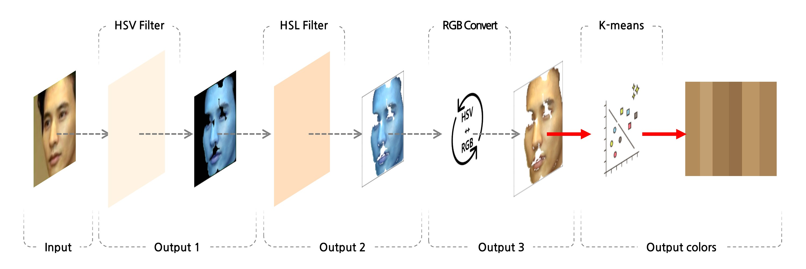
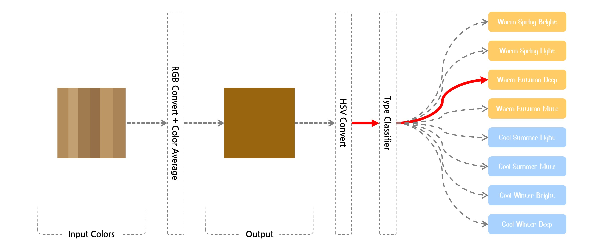
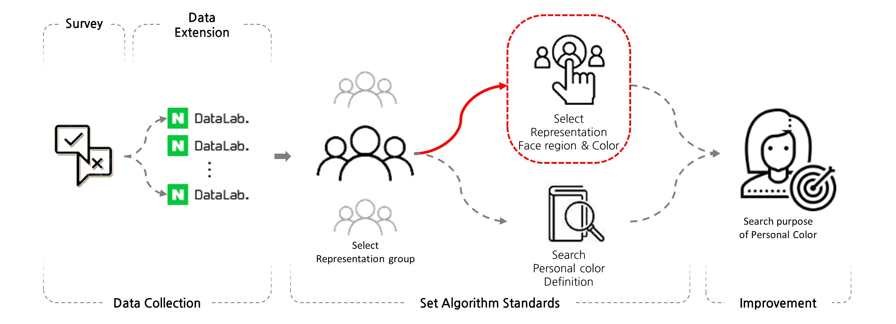
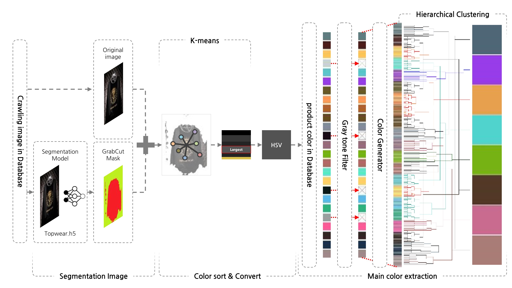
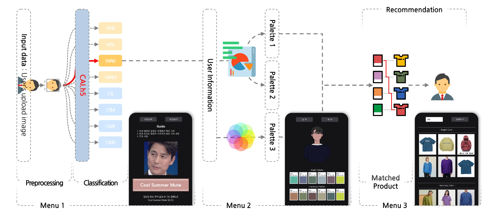

# CAI(Color Artificial Intelligence)
   
---
   
## [ About CAI Project ]
`CAI`는 사용자가 업로드한 사진을 딥러닝 모델을 적용하여 퍼스널컬러 타입을 진단하고, 이를 기반으로 퍼스널컬러 팔레트와 패션 아이템을 추천합니다.   
기존에 사람의 눈에 의해 판단되었던 주관적인 퍼스널 컬러 타입의 진단 과정을 사용자에게 제공받은 사진을 화이트 밸런스 조정 등 전처리를 거쳐 얻은 측색 결과로 사용자의 퍼스널 컬러 타입을 진단합니다.   
   
`Personal Color`는 개인 고유의 신체색을 의미하며, 개인의 특성을 분석하여 퍼스널컬러 타입 분류체계의 한 타입에 개인을 대응시켜 그에 조화를 이루는 색을 진단하여 적합한 메이크업, 헤어, 의상 등의 색채 이미지를 연출하는 시스템입니다.   
   
#### `< CAI Total Process >`   
   
   
---
   
## [ Deep Learning_Personal Color Type Classifier ]
   
### Dataset Creater

#### `< Face Detection >`   
   
   
#### `< Skin Color Extraction >`   
   
   
#### `< Color System Converter & Type Classifier >`   
   
   
- `Face Detection`   
	얼굴인식, 이미지 리사이징 (input image 약 20만장 / output image 약 15만장)   
	인물 이미지를 전처리 후 `Haar Cascade`방식으로 얼굴 인식, 통일된 사이즈로 얼굴 이미지 획득   
- `Skin Color Extraction`   
	Face Detection으로 얻은 얼굴 이미지에서 안면색 추출   
	측색의 정확도를 위해 2가지 필터 사용, K-means 방식을 이용해 색 추출   
- `Color System Converter`   
	추출된 색 리스트를 평균 색으로 대체 하여 알고리즘 적용을 위한 색 체계 변환   
	(BGR → RGB → HSV)   
- `Type Classifier`   
	퍼스널컬러 타입 분류 알고리즘을 적용해 측색 결과 값(안면 색)으로 데이터셋 생성   
   
   
### Deep Learning

#### `< CNN/AlexNet >`   
   
   
`AlexNet` : 색상인 부분과 색상이 아닌 부분으로 나누어 처리되기 때문에 '색 학습'에 용이하다고 판단하여 선정   
Result model : `CAI.h5`   
   
---
   
## [ Color Palette Extraction ]
   
### Bright Palette & Harmony Palette

#### `< Personal color Analysis >`   
   

색 이론과 퍼스널컬러 관련 논문을 참고하여 1차 측색 부위 & 진단 색 선정   
퍼스널컬러 이론과 측색 부위 & 진단 색의 합리성을 검정하기 위해 설문조사 진행   
다각적 분석과 정확성을 위해 네이버 데이터랩 이용, 분석 확장   
분석 결과에 따라 퍼스널컬러 타입 분류 기준인 측색 부위 & 진단 색 변경   
[* Personal color theory analysis report](https://github.com/slmteruto/CAI/blob/master/jay/Analysis/Report/Color_theory_analysis.ipynb)   
[* Personal color statistical analysis report](https://github.com/slmteruto/CAI/blob/master/cys/CAI_elementaryItem_analysis.ipynb)   
   
   
### Main purchase Palette

#### `< Data acquisition & Main color Extraction >`
   

- `Clothes color Extraction`   
	상품 이미지를 `Topwear.h5`(패션아이템 분리 모델)을 이용해 마스크 생성   
	원본 이미지에 마스크를 결합하여 패션아이템을 제외한 이미지 영역 삭제   
	K-means 방식을 이용해 색 추출, 상품 별 색 데이터를 데이터베이스에 적재   
- `Main color Extraction`   
	사용자의 구매상품을 실시간으로 조회, 구매한 상품의 색 리스트를 획득   
	Gray tone Filter를 이용해 리스트 중 흑백에 근접한 상품을 제외   
	클러스터링의 오차를 줄위기 위해 Color Generator로 구매상품 색상 규모 확장   
	확장된 색 데이터를 `Hierarchical Clustering`를 이용해 주요 구매 색상 팔레트를 추출   
   
---
   
## [ Webstie ]

#### `< Web structure >`
   

- `Personal color type Prediction`   
	웹을 통해 사용자가 업로드한 사진을 **CAI.h5**를 적용, 퍼스널컬러 타입을 예측해 사용자에게 안내   
- `Matched Personal color palette`   
	사용자의 타입 결과와 **Skin Color Extraction**로 추출한 피부색에 대응하는 개인화 팔레트를 제공   
- `Fashion item Recommendation`   
	추출된 3가지 팔레트에 해당하는 상품을 데이터베이스에서 실시간으로 조회해 추천, 사용자별 개인화 서비스를 제공   
	※ 팔레트1 : **Bright Palette** / 팔레트2 : **Harmony Palette** / 팔레트3 : **Main purchase Palette**   
[* Clustering accuracy evaluation report](https://github.com/slmteruto/CAI/blob/master/jay/Analysis/Report/Clustering_Evaluation.ipynb)   