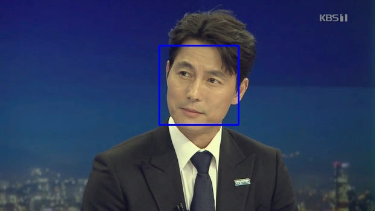

# CAI(Color Artificial Intelligence)
---

## About CAI
`CAI`는 사용자에게 퍼스널 컬러 타입을 진단하고, 그에 맞는 퍼스널컬러를 기반으로 패션 아이템을 추천합니다.   
기존에 사람의 눈에 의해 판단되었던 주관적인 퍼스널 컬러 타입의 진단 과정을 사용자에게 제공받은 사진을 화이트 밸런스 조정 등 전처리를 거쳐 얻은 측색 결과로 사용자의 퍼스널 컬러 타입을 진단합니다.   
####약 ???장의##### 얼굴 이미지 측색값으로 머신러닝을 통해서 더 객관적이고 정확한 타입을 진단하고, 이전까지는 타입별 고정된 퍼스널컬러를 매칭했다면 이를 더 확장하여 각 사용자의 특성을 살려 각 개인화된 퍼스널컬러를 매칭하며, 매칭된 퍼스널컬러에 맞는 패션 아이템을 추천하는 기능을 수행하여 사용자에게 정확성과 편리함을 제공합니다.   
- <b>??? 소제목 뭐라고 하지 ??? Project Process??</b>   
`Decision Standard`   
정성적 관능평가로 진행되는 퍼스널컬러 타입 분류에 대한 기준 수립   
진단받은 퍼스널컬러에 따라 매칭할 패션 아이템의 색 범위 수립   
`Machine Learning`   
이미지 전처리, 해당 이미지에서 얼굴을 인식해 측색 부위를 결정   
피부색을 추출(RGB)하여 색 범위 설정을 위해 표기법 변환(HSV), 사전에 수립한 기준에 따라 퍼스널타입 분류   
`Product Information`   
상품정보 크롤링을 통해 각 상품의 정보(랭킹, 상품 이미지 등)를 수집하여 DB 적재   
이미지 전처리, 해당 이미지에서 패션아이템을 인식해 측색 위치를 결정   
대표 색상을 추출(RGB)하여 색 범위 지정을 위해 표기법 변환(HSV) 후 DB 추가   
사용자에게 진단된 퍼스널컬러 타입별 아이템 매칭 시 이용

### 퍼스널컬러 시스템   
`퍼스널컬러`는 개인 고유의 신체색을 의미하며, 개인의 다양한 특성을 분석하여 퍼스널컬러 타입 분류체계의 한 타입에 개인을 대응시켜 그에 조화를 이루는 색을 진단하여 각 개인에게 적합한 메이크업, 헤어, 의상 등의 `색채 이미지를 연출`하는 시스템입니다.   
기초적으로 색채재비와 착시현상의 이론적인 내용에 따르며, 밝고 생기있는 긍정적인 이미지를 형성하는 데 도움을 주는 것을 목적으로 합니다. 하지만 이러한 퍼스널컬러 시스템은 개인의 특징을 진단하는 기준이 뚜렷하지 않고, 평가 방법이 관능평가(사람이 감각기관을 통해 조사하는 것)인 한계점을 가지고 있습니다.   
- 퍼스널컬러 타입 분류 체계   
`Spring warm bright`, `Summer cool light`, `Autumn warm mute`, `Winter cool deep`   
`Spring warm light`, `Summer cool mute`, `Autumn warm deep`, `Winter cool bright`   

### Color theory basic
색상환(사람이 인식하는 색들을 비슷한 순서로 붙여 원을 이룬 배열)의 중심축에서 수평방향으로 채도 변화를 표현하고, 수직방향으로 명도 변화를 표현한 원통형태의 3차원 색좌표를 색공간 또는 색체계라고 한다.   
- `Munsell color system` : 최초로 고안된 색공간. 색상(Hue), 명도(Value), 채도(Chroma) 속성으로 표시
- `RGB` : 삼원색(Red, Green, Blue)를 합치면 흰색이 되는 빛의 특성을 이용해 색을 표현하는 가산혼합법
- `HSV` : 인간의 시각 특징을 고려해 고안된 색상(Hue), 채도(Saturation), 명도(Value)로 색을 표현하는 방법
- 보색대비   
- 착시현상도??   
[Munsell Color Palette](http://pteromys.melonisland.net/munsell/) 먼셀표기법에 따른 색상 확인 가능   
[Adobe Color](https://color.adobe.com/ko/create) RGB, HSV 등 표기법에 따른 조화색상 확인 가능   

### Personal Color Skin Tone
> 안면 색이 퍼스널 컬러 유형 분류 시스템의 독립변수라는 것은 Fujii and von Alten(1992)에 의해 밝혀져 있다.   
> 여성들이 이마와 턱에 비해 볼의 황색도를 보정하지 않는다는 분석결과를 통하여 여성이 볼의 스킨 톤을 자신의 전체 스킨 톤을 대표한다고 생각하고, 볼의 스킨 톤을 살리는 것이 개성을 나타내는 가장 자연스러운 방법이라고 판단한다고 볼 수 있다. 따라서 상술한 근거를 통해 퍼스널 컬러 유형 분류 시스템의 독립변수로 안면부의 볼의 스킨 톤을 특정하였다.   
> 김용현·오유석·이정훈. 퍼스널 컬러 스킨 톤 유형 분류의 정량적 평가 모델 구축에 대한 연구. 한국의류학회지, 42(1), 121~132
    
> 논문내용 입력   
> 이소영(2019), 퍼스널컬러의 톤 유형과 피부색에 따른 조화색의 범주화. 홍익대학교 문화정보정책대학원 석사학위논문.

한국인의 피부색에 맞는 퍼스널컬러 타입을 분류하기 위해 다양한 정량적인 평가를 위한 통계 연구가 진행되었고, 위와 같은 논문들을 참고하여 피부색 측정 부위는 얼굴 중에서도 볼로 한정하였으며, 퍼스널컬러 타입의 분류 기준을 아래와 같이 정하였다.   
- 1 Depth. WARM TONE & COOL TONE   
- 2 Depth. SEASON CLASSIFICATION (Value)   
- 3 Depth. S/V CLASSIFICATION   

1 Depth|2 Depth|3 Depth|Hue|V-S|S & V-S
:---:|:---:|:---:|:---:|:---:|:---:
WARM|SPRING|BRIGHT|26-206|43.15↑|32.47↑
WARM|SPRING|LIGHT|26-206|43.15↑|32.47↓
WARM|AUTHUM|DEEP|26-206|43.15↓|32.47↑
WARM|AUTHUM|MUTE|26-206|43.15↓|32.47↓
COOL|SUMMER|LIGHT|0-25, 207-359|47.15↑|60.80↑
COOL|SUMMER|MUTE|0-25, 207-359|47.15↑|60.80↓
COOL|WINTER|BRIGHT|0-25, 207-359|47.15↓|23.58↑
COOL|WIMTER|DEEP|0-25, 207-359|47.15↓|23.58↓

### 얼굴 측색
- 화이트밸런스 조정 : 희승's blahblah 
- 얼굴 인식 예시   

Original|White Balance|Face Detection|Resizing|cheek Detection|Tone Detection
:---:|:---:|:---:|:---:|:---:|:---:
|||</img>|</img>|</img>

### 퍼스널컬러 매칭
- 명암 / 채도 차이를 기준으로 타입별 퍼스널컬러 매칭 값 조정 내용 설명

### 패션 아이템 추천

https://heropy.blog/2017/09/30/markdown/